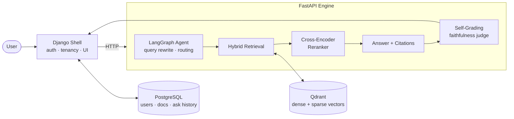

<div align="center">

# Attest

**A retrieval system that grades its own answers — and refuses to answer when it can't stay grounded.**

Multimodal, self-evaluating RAG over real SEC filings.

[](https://www.python.org/)
[](https://www.djangoproject.com/)
[](https://fastapi.tiangolo.com/)
[](https://qdrant.tech/)
[](https://www.postgresql.org/)
[](https://docs.docker.com/compose/)
[](https://langchain-ai.github.io/langgraph/)
[](https://docs.ragas.io/)

[](#results)
[](#results)
[](#the-metric-we-did-not-hit)
[](#roadmap)

</div>

---

## What this is

Most retrieval-augmented generation demos answer confidently and are never asked to prove it. Attest is built the other way around.

You give it a real financial filing. You ask a plain-English question. It retrieves the relevant passages, answers with citations pointing back to the exact page, and then **runs a second model over its own answer** to check whether every claim is actually supported by the retrieved text. If the answer isn't grounded, it says so instead of inventing one.

The evaluation criteria were **frozen before a single line of the pipeline was written**, so the numbers below are a contract the system had to meet — not a target chosen after seeing the results.

The corpus is Apple's FY2025 Form 10-K, a 65-page SEC filing including tables and figures.

---

## Results

Measured with [RAGAS](https://docs.ragas.io/) against a hand-built gold set, using an independent judge model on a separate API key from the answering model.

| Metric | Target (frozen §02) | Measured | |
|---|---|---|---|
| **Faithfulness** — are the answer's claims supported by retrieved text? | ≥ 0.90 | **1.000** | ✅ PASS |
| **Answer relevancy** — does the answer address the question asked? | ≥ 0.85 | **0.979** | ✅ PASS |
| **Hallucination flag** — does it refuse unanswerable questions? | < 0.50 | **0 / 3 hallucinated** | ✅ PASS |
| **Context precision** — is the retrieved context actually relevant? | ≥ 0.85 | **0.774** | ❌ **FAIL** |

### The metric we did not hit

**Context precision came in at 0.774 against a 0.85 target, and it is rendered on the product's own trust dashboard rather than hidden.**

This is deliberate. A system whose entire premise is measurement honesty does not get to quietly drop the number it doesn't like.

The diagnosis: retrieval *recall* is fine — the right passage is reliably inside the candidate set. The weakness is **ranking**. Relevant chunks are being retrieved but not consistently promoted to the top positions, which drags precision down without hurting faithfulness, because the generator still finds the grounding it needs further down the list. The fix belongs in the reranking stage, and it is scheduled rather than papered over.

An interviewer asking "what's broken and why?" gets a real answer. That was the point.

---

## Latency: measure before you blame

End-to-end response times were slower than the 8-second p95 target, so the pipeline was profiled stage by stage rather than optimised on instinct.

| Where the time goes | Share |
|---|---|
| Third-party model provider calls | **96.9%** |
| Attest's own retrieval, fusion, and reranking stack | **3.1%** |

The system's own machinery is not the bottleneck — the hosted LLM is. Observed end-to-end times have ranged from ~14s for a grounded answer to a 251s outlier on a question shape that had previously completed in 14s, indicating provider-side variance rather than a code path regression.

**This is why the number is reported as a breakdown and not as a single figure.** "Slow" is not a finding. "96.9% of it is not ours" is.

---

## Architecture



### The retrieval pipeline

1. **Ingestion** — the filing is parsed page by page. Text is chunked; figures and charts are sent to a **vision model** and their descriptions are embedded *alongside* the text, so a question about a chart is answerable through the same index.
2. **Hybrid search** — every query runs twice: a **dense** semantic search (`bge-small-en-v1.5`) that understands meaning, and a **sparse** keyword search (BM25) that catches exact terms like line-item names and figures. Dense search alone misses literal tokens; sparse alone misses paraphrase.
3. **Reciprocal Rank Fusion** — the two result lists are merged by rank position rather than by raw score, since the two scoring scales aren't comparable.
4. **Cross-encoder reranking** — `bge-reranker-base` re-reads each candidate *together with* the query, which is slower than embedding comparison but far more accurate, and reorders the shortlist.
5. **Agentic answering** — a LangGraph agent rewrites the query when the first attempt retrieves poorly and routes multi-step questions, with no hardcoded conditional logic.
6. **Self-grading** — an independent judge model scores the answer's faithfulness against the retrieved context. Ungrounded answers are flagged and refused rather than returned.

### Multi-tenancy

Every vector carries an owner in its payload, and retrieval is filtered at the database level, not after the fact. Three tenants share one collection with no cross-tenant leakage:

| Tenant | Corpus | Points |
|---|---|---|
| `alice` | Apple FY2025 10-K (65 pages) | 285 |
| `bruno` | synthetic excerpt | 10 |
| `carla` | synthetic excerpt | 9 |
| | **Total** | **304** |

The isolation test is paired with a **positive control** — a filter matching zero results is indistinguishable from a filter that works, so every isolation check sits beside a case that must return data.

---

## Tech stack

| Layer | Choice | Why |
|---|---|---|
| Web shell | Django 5 | Batteries-included auth, sessions, ORM, admin |
| Inference engine | FastAPI | Async, lightweight, clean separation from the shell |
| Vector store | Qdrant | Named vectors for dense + sparse in one collection, payload filtering |
| Relational store | PostgreSQL 17 | Users, documents, ask history, audit trail |
| Dense embeddings | `bge-small-en-v1.5` | Strong retrieval quality per megabyte |
| Sparse retrieval | BM25 via FastEmbed | Exact-term matching the dense model misses |
| Reranking | `bge-reranker-base` | Cross-encoder accuracy on the shortlist |
| Agent | LangGraph | Explicit state graph over implicit prompt chaining |
| Generation | Gemini Flash | Fast, long-context, cost-effective |
| Evaluation | RAGAS 0.4.3 | Standard metrics, run in an isolated container |
| Orchestration | Docker Compose | Four services, reproducible from a cold clone |

The answering model and the judge model use **separate API keys on separate projects**, so the system cannot grade itself with the same credentials it answers with.

---

## Quickstart

**Requirements:** Docker with Compose, and a Gemini API key.

```bash
git clone https://github.com/Manglam11/attest.git
cd attest
cp .env.example .env
# fill in GEMINI_API_KEY, JUDGE_API_KEY, and the Postgres/secret values
docker compose up -d
```

Cold start to all four services answering: **~39 seconds** measured. The engine is slowest because embedding and reranker models load at import time; its health check allows for this. Watch `docker compose ps` rather than the terminal going quiet.

Then open <http://localhost:8001/>.

For a deployment-shaped run without source bind mounts or hot reload:

```bash
docker compose -f docker-compose.yml -f docker-compose.prod.yml up -d
```

---

## Engineering log

Real defects found and fixed, kept because the debugging is more interesting than the happy path.

- **The image was 4× too large for the wrong reason.** The engine image weighed 8.66 GB. The hypothesis — that `sentence-transformers` was pulling CUDA-linked PyTorch despite a CPU-only deployment target — was confirmed cheaply by inspecting the built image rather than by rebuilding: NVIDIA wheels, CUDA torch, and Triton accounted for ~4.5 GB, and `torch.cuda.is_available()` was `False` anyway. Switching to CPU-only torch took the image to **2.12 GB (−75.5%)** and resident memory to ~800 MB. Proven safe by re-running a fixed retrieval query and diffing chunk ids, ranks, and reranker scores against a pre-change baseline — byte-for-byte identical.

- **The built image was never what ran.** While removing development bind mounts, the shell's Dockerfile turned out to have never copied the Django application into the image at all. Every environment had been running entirely off the host mount. Nothing failed, because the mount always masked it — a defect that only a production-shaped configuration could surface.

- **The quota ceiling was decorative.** The daily API ceiling existed only inside offline evaluation scripts. The live request path incremented a counter but never consulted it, and the vision ingestion path spent quota without counting at all. Both are now gated fail-fast, before any model call, proven in both directions with the generation call stubbed so neither proof could spend a request.

- **When the model and the ruler disagree, suspect the ruler.** An early correctness failure was traced not to the pipeline but to a bug in the gold set used to grade it.

- **A test that cannot fail is not a test.** Every verification here states what a failure would look like *before* it runs. A check that can only pass silently gets a positive control beside it.

---

## Roadmap

- [x] **Turn 1** — thin end-to-end skeleton, alive from day one
- [x] **Turn 2** — ingestion and hybrid retrieval
- [x] **Turn 3** — reranking and evaluation harness
- [x] **Turn 4** — multimodal figure understanding
- [x] **Turn 5** — agentic query rewriting and routing
- [x] **Turn 6** — multi-tenancy, trust dashboard, ask history
- [ ] **Turn 7** — cloud deployment and CI/CD *(in progress)*
- [ ] Context precision: lift 0.774 → ≥ 0.85 via reranker depth tuning
- [ ] Asynchronous ask pipeline so provider latency can never discard a completed answer
- [ ] In-app document upload

Built solo, in layered passes — one product deepened turn over turn, never rewritten as v1/v2/v3.

---

## Contact

**Manglam**

[]([YOUR_LINKEDIN_URL_HERE](https://www.linkedin.com/in/manglam-dubey/))
[](mailto:manglamdubey11@gmail.com)

Questions about the architecture, the evaluation methodology, or the metric that failed are all welcome — especially the last one.

---

<div align="center">

> *"Program testing can be used to show the presence of bugs, but never to show their absence."*
>
> — **Edsger W. Dijkstra**

<sub>Which is why Attest shows you both.</sub>

</div>